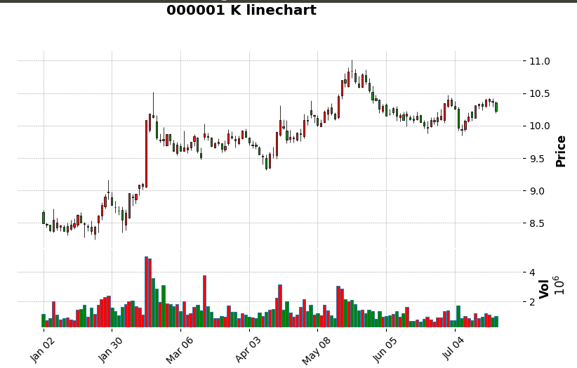
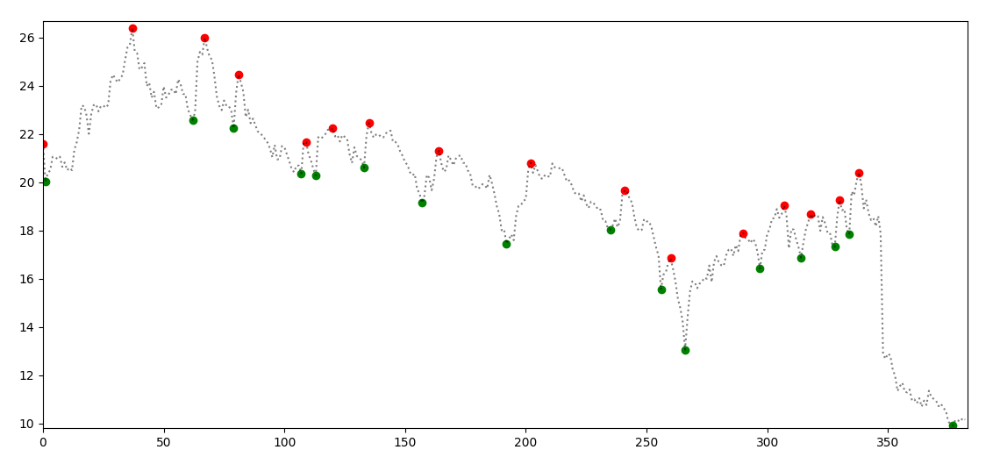
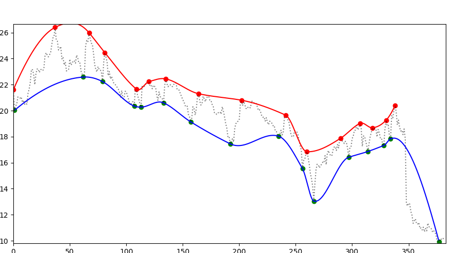
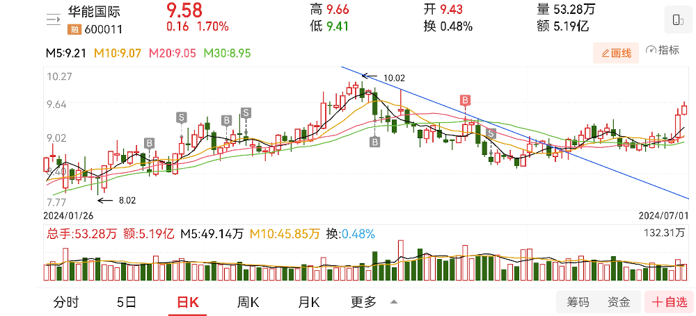
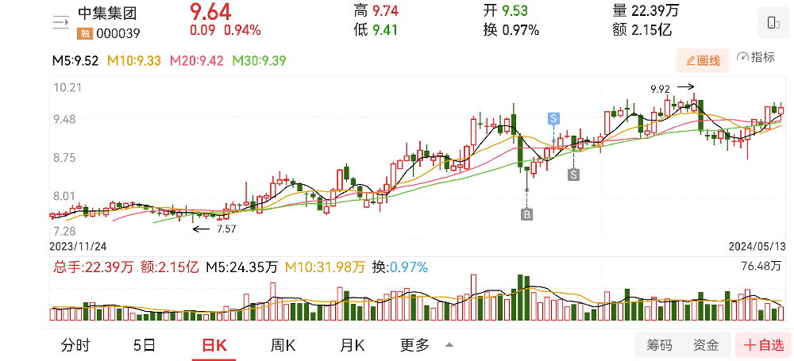
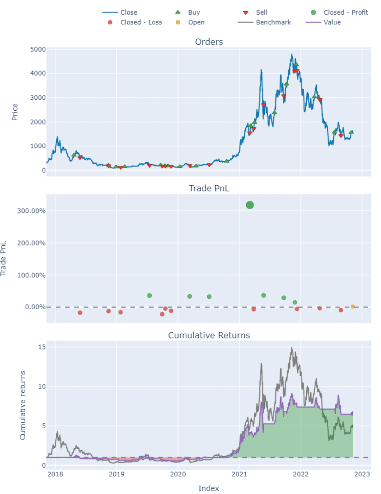
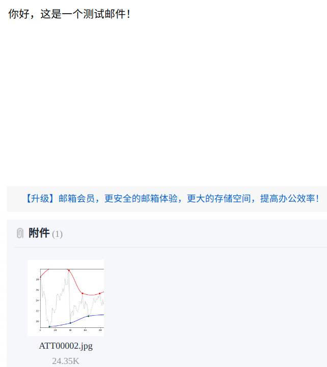

## 数据

### 数据源

[AKShare](https://akshare.akfamily.xyz/introduction.html) 介绍

### 数据下载

示例：股票历史行情

### 数据基本处理

读写

* pickle

增

删

改

查

#### 常用python-lib

* pandas
* numpy
* datetime
* pickle

#### 示例：保存股票的历史数据

### 数据绘制

常用绘制python包

* matplot
  * mplfinance

https://blog.csdn.net/Shepherdppz/article/details/117575286

### 数据处理

#### zigzag提取

#### support/pressure

一维插值算法

#### 技术面分析

示例：

股票筛选

1. 上升趋势，波段清晰
2. 趋势没有大的改变，如涨跌比例、涨跌时间跨度
3. 各波段成交量没有大的变化

#### 买卖点

### 回测

vectorbt进行策略回测

### 发布

将筛选的股票分析报表发送至指定邮箱。

### 部署

树莓派-linux

* 数据自动更新
* 策略自动运行和发布

笔记本-windows
